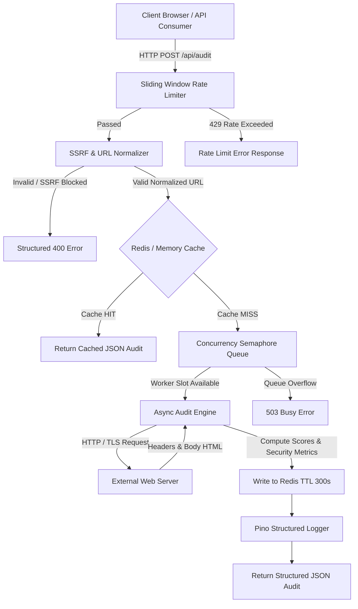

# Task B: Complete Architecture & Engineering Specification

**System Name:** Page Pulse URL Audit Service  
**Target Load:** 10,000 Audits / Day | Peak Burst 500 Concurrent Requests  
**SLA Target:** 99.9% Uptime | P95 Latency < 1,500ms  
**Submission:** Digital Heroes Senior SDE Qualification Assignment  

---

## 1. System Architecture & Component Design

Page Pulse is engineered as an event-resilient, non-blocking asynchronous micro-service. It handles high-concurrency URL auditing with built-in SSRF defense, distributed Redis caching, and semaphore concurrency management.

### Component Breakdown
1. **API Ingress & Rate Limiter**: Implements a sliding window counter per client IP (default 100 req/min). Automatically returns `429 Too Many Requests` with a `Retry-After` header.
2. **SSRF Shield & Normalizer**: Parses input URLs, strips fragments/credentials, validates standard HTTP/HTTPS protocols, and screens IP ranges against RFC 1918 (10/8, 172.16/12, 192.168/16), loopback (127/8, ::1), cloud metadata (169.254.169.254), and link-local ranges.
3. **Cache Layer (Redis with In-Memory Fallback)**: Uses Base64URL normalized URL hashes as cache keys. Returns cached audits within 300s TTL. If Redis is down, it seamlessly falls back to an in-memory LRU store without dropping requests.
4. **Concurrency Semaphore Queue**: Enforces configurable concurrency constraints (`MAX_CONCURRENCY=500`). Queues burst requests and drains them in FIFO order to prevent CPU/socket starvation.
5. **URL Audit Engine**: Performs asynchronous HTTP/HTTPS checks using `AbortController` (default 5,000ms timeout). Evaluates security headers (HSTS, CSP, X-Frame-Options), SEO meta tags (title, description, OG tags, canonical), performance metrics (TTFB, size, compression), and SSL status.

---

## 2. Technology Decision Record (TDR)

| Core Technology | Reason Chosen | Alternative Considered | Reason Alternative Rejected |
| :--- | :--- | :--- | :--- |
| **Node.js + Express + TypeScript** | Non-blocking async I/O loop ideal for high HTTP concurrency; native TypeScript type safety across stack. | Python + FastAPI | Lower raw concurrent I/O throughput for un-bound network sockets compared to V8 event loop. |
| **Redis (ioredis)** | Sub-millisecond key-value lookups, built-in TTL expiration, atomic increment counters for rate limiting. | Memcached | Memcached lacks native persistence, rich data structures, and easy failover capabilities. |
| **In-Memory Cache Fallback** | Ensures 100% service uptime even during total Redis infrastructure outages. | Hard Redis Dependency | Applications crash or throw 500 errors if Redis is temporarily unreachable. |
| **Pino Logger** | Low-overhead JSON logger capable of serializing thousands of logs/sec without blocking the event loop. | Winston | Winston has higher CPU overhead and memory footprint during high-throughput logging. |
| **Zod Schema Validation** | Zero-dependency TypeScript-first runtime type inference and strict object parsing. | Joi | Joi is larger in bundle size and lacks native TypeScript type inference. |
| **Vitest + Supertest** | Instant ESM test execution, zero-config integration with Vite build tools. | Jest | Jest requires complex Babel/ts-jest setup for ES Modules and TypeScript. |

---

## 3. Failure Mode Analysis (FMA)

### Failure Mode 1: Complete Redis Cache Outage
* **Cause**: Network split, Redis container crash, or cloud memory pressure eviction.
* **Impact**: Loss of remote caching capability; potential surge in external fetch requests.
* **Detection**: Pino log alerts catching `Redis connection dropped`, `/api/health` reporting `cache.isRedis: false`.
* **Mitigation**: Automatic in-memory LRU fallback activates instantly inside `redisCache.ts`.
* **Recovery**: Once Redis reconnects, the client re-establishes socket pool and switches back automatically.

### Failure Mode 2: Extreme Traffic Spike (e.g. 2,000 Concurrent Requests)
* **Cause**: DDOS attack, viral event, or batch script execution.
* **Impact**: Threat of CPU starvation, memory exhaustion, or outbound socket depletion.
* **Detection**: Rate limiter active counters spiking, queue length exceeding warning threshold.
* **Mitigation**:
  1. Rate limiter throttles offending IPs with `429 Too Many Requests`.
  2. Concurrency manager buffers up to `MAX_CONCURRENCY=500` and `MAX_QUEUE_LENGTH=1000`.
  3. Excess requests beyond queue bounds receive structured `503 Service Unavailable` errors.
* **Recovery**: Drains queue safely without dropping process or corrupting active audits.

### Failure Mode 3: External Target Website Hanging / Slow DNS
* **Cause**: Target server deadlocks, firewalls drop packets, or tarpits request.
* **Impact**: Worker threads locked waiting for HTTP response.
* **Detection**: Spike in request duration telemetry.
* **Mitigation**: `AbortController` enforces a hard `5000ms` HTTP timeout, freeing workers immediately.
* **Recovery**: Returns structured `504 HTTP_TIMEOUT` error to caller.

---

## 4. Observability & Monitoring Plan

### Telemetry Metrics Tracked
* **Latency Percentiles**: P50, P95, and P99 response time in milliseconds.
* **Cache Metrics**: Hit ratio percentage, total hits vs. misses, memory store item count.
* **Queue Health**: Active worker count, queued requests, average queue wait duration.
* **HTTP Errors**: Rate of 4xx (Client/SSRF) and 5xx (Upstream/Timeout) responses.

### Prometheus & Grafana Alert Rules
1. **High P95 Latency Alert**: Triggered if P95 latency exceeds `2,000ms` over a 5-minute window.
2. **High Error Rate Alert**: Triggered if 5xx HTTP response rate exceeds `2%` of total traffic.
3. **Cache Hit Ratio Drop**: Triggered if cache hit ratio falls below `40%` under steady traffic.
4. **Queue Saturating**: Triggered if queue length exceeds `800` items (`80%` capacity).

---

## 5. Rollback & Deployment Strategy

### Deployment Architecture
* **Blue-Green Deployment**: Run new container release alongside current active release in Cloud Run / Kubernetes. Verify health check `/api/health` before updating router traffic weight.
* **Canary Release Strategy**: Route 10% of production traffic to new version for 15 minutes while monitoring P95 latency and error rate.

### Emergency Rollback Checklist
1. Identify regression via Pino log telemetry or Grafana error alerts.
2. Revert load balancer / Cloud Run traffic percentage back to previous image tag (`v1.0.x-previous`).
3. Flush corrupt Redis cache keys if schema changes occurred (`redis-cli KEYS "audit_cache:*" | xargs redis-cli DEL`).
4. Re-run `/api/health` test suite to verify baseline recovery.
